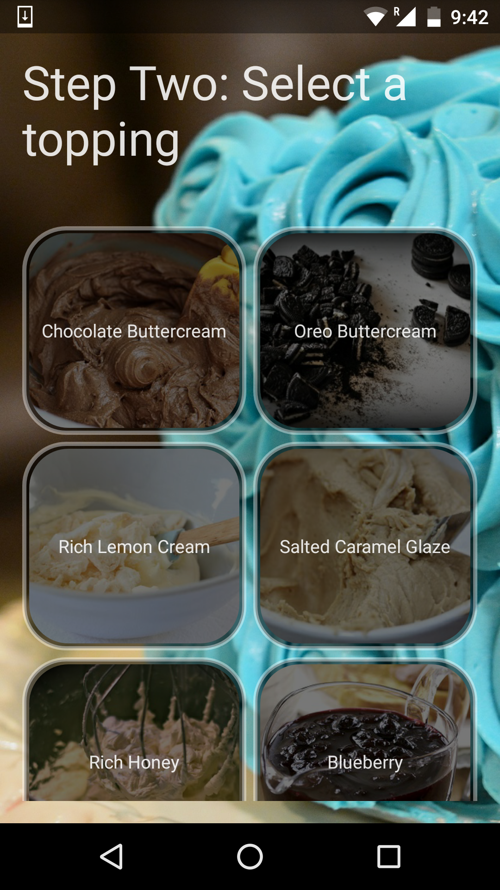
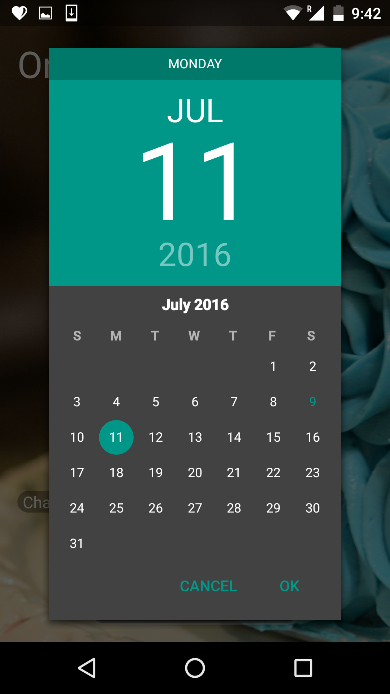
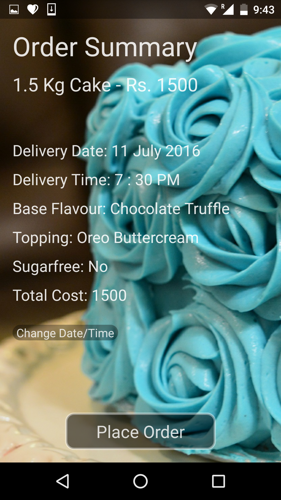

# Kitcheneesta

Initially developed for the 2015 TiE Young Entrepreneurs program, Kitcheneesta is an Android application that allows the Kitcheneesta bakery customers to remotely customise and order cakes for delivery via a simple and clean user interface. 

This project helped me gain familiarity with designing user interfaces, and
implementing complex layouts, list adapters and GridViews. 

